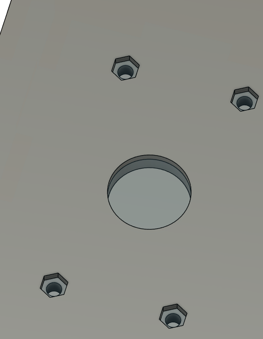

# V1

Note there are a few downsides to the current design and will be changed within the next design.

1. The enclosure is too tall. I gave too much room for the switches and the raspberrypi shield. Next iteration will be lower. 
2. The PCB will be bought from JLC next time because PCB way cost too much for anything outside of its initial 100x100mm PCB. I want to achieve a slimmer design. Or I can still get from PCBway and fit it within 100x100 mm.

# Design 

## CAD Models

### Housing

Back component was designed to mount a USB-C cable where there is an extension cable connecting USB-C F to micro-USB M as raspberry pi zero uses micro-USB port.

Top components utilizes hex holes to hold the screws to it is easier to bolt in the stick switch from the bottom.

The top component is also made symmetrical so it could be flipped to the other side to make the stick on the right. 

## Build

Assembled 

Quick peek at the raspberry pi zero shield where only power and ground is connected. This shield provides enough pins to power LED's if needed to be connected. Current version of the shield is only in Altium will be implemented with KiCAD next time. 

Wires are crimped to hold onto switches.

Next design will provide the housing to have screw holes to mount raspberry pi zero shield.

The back of the housing as can be seen have 2 screws to hold the adapter. 